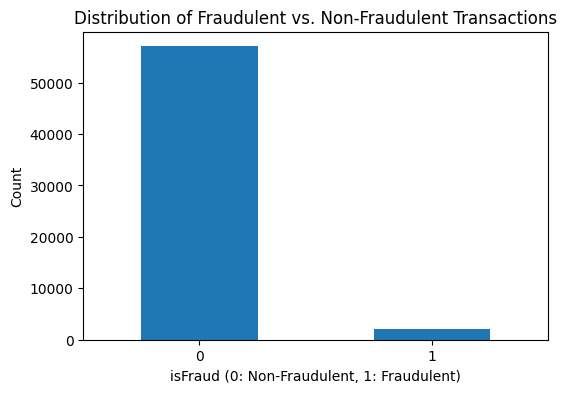
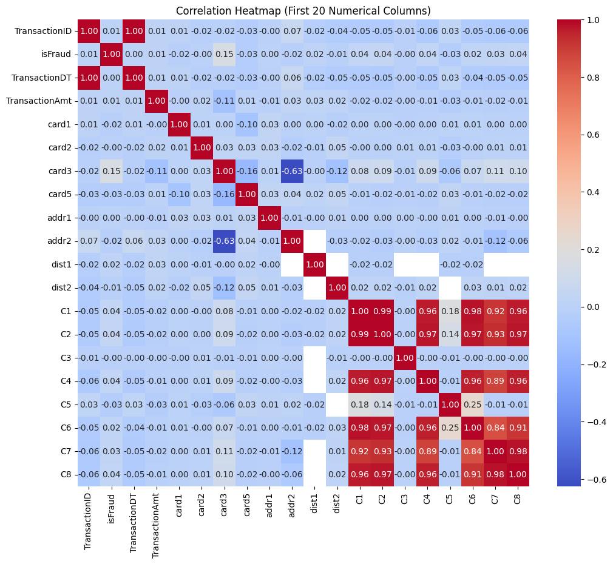

# 🛡️ Exploratory Data Analysis (EDA) on IEEE-CIS Fraud Detection Dataset

## 📌 Project Overview
This project explores the **IEEE-CIS Fraud Detection dataset**, which contains anonymized credit card transaction data. The primary goal of this analysis is to understand the structure of the dataset, identify patterns, visualize relationships, and extract insights that can be useful in fraud detection.

This work is part of my **data science portfolio**, showcasing my transition from a research background in Physics into applied data science.

---

## 🧰 Tools & Libraries
- **Python** (Jupyter Notebook)
- **pandas** and **numpy** for data wrangling
- **matplotlib** and **seaborn** for data visualization

---

## 🔍 Key Analysis Steps
1. **Data Inspection**
   - Reviewed dataset shape, datatypes, and missing values.
   - Assessed class balance between fraudulent and non-fraudulent transactions.

2. **Data Cleaning**
   - Handled missing values with basic strategies.
   - Checked for duplicate transactions.

3. **Exploratory Visualizations**
   - Histograms of key numerical features
   - Bar plots for categorical distributions
   - Correlation heatmap of selected variables

4. **Fraud vs. Non-Fraud Comparison**
   - Distribution of transaction amounts
   - Feature differences between fraud and non-fraud classes

---

## 📊 Insights
- Fraudulent transactions tend to have different distributions compared to non-fraud, especially in transaction amount and certain features.
- Several variables contain significant missing values, which may themselves be predictive.
- Strong correlations exist between a few anonymized features, hinting at possible feature engineering opportunities.

---

## 📸 Sample Visuals from the Notebook

Here are some key plots generated in this notebook:

| Fraud vs. Non-Fraud Distribution | Correlation Heatmap |
|----------------------------------|---------------------|
|  |  |

---

## 📁 Files in This Repository
- `EDA_IEEE_FraudDetection.ipynb`: Jupyter notebook with the full analysis
- `images/`: Folder containing exported plots for README
- `data/`: (optional) data directory, or dataset link below

---

## 📂 Dataset Access
Due to size and licensing, the dataset is not uploaded here. You can access it directly from Kaggle:  
👉 [IEEE-CIS Fraud Detection Dataset on Kaggle](https://www.kaggle.com/c/ieee-fraud-detection)

---

## 🚀 Next Steps
- Perform advanced feature engineering
- Build baseline ML models for fraud prediction
- Evaluate model performance using metrics like AUC-ROC, precision, and recall

---

## ✍️ Author
**Adebayo Fashina**  
📍 Toronto, Canada | [LinkedIn](https://www.linkedin.com/in/your-link-here)
